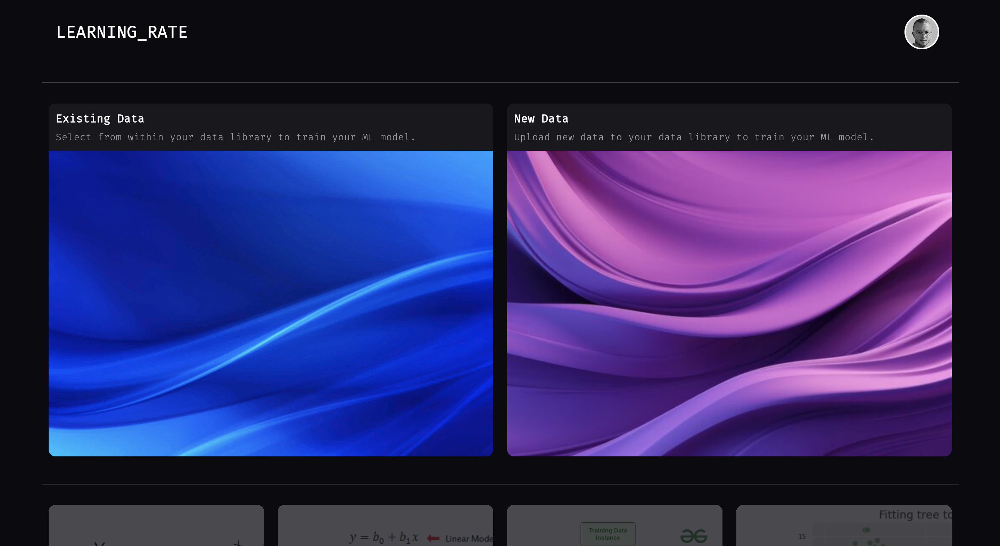
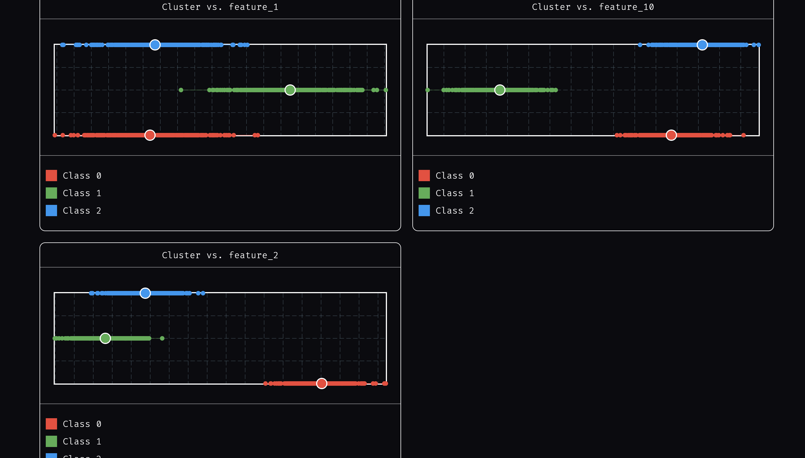
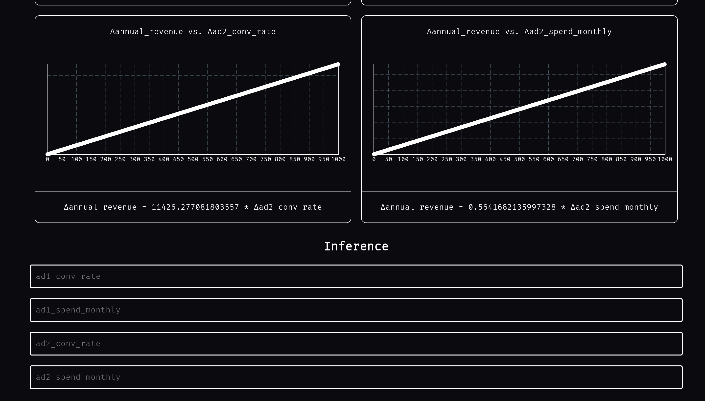
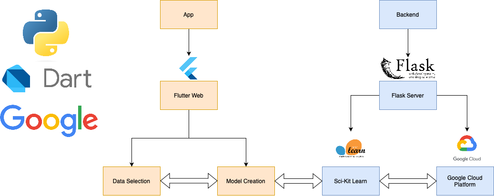

  
   

  
  

# Learning Rate
Learning Rate is a cutting-edge platform designed to democratize machine learning, allowing users to easily upload their own data and quickly create, train, and deploy machine learning models with just a few clicks. This user-friendly interface simplifies the complex process of data science, making it accessible to non-experts seeking to leverage the power of ML for data analysis and inference.

The core of Learning Rate utilizes Scikit-Learn for its robust, efficient algorithms and Google Cloud Platform as a Data Lake for user model and data storage. Users can interact through a sleek Flutter-based interface, where they can upload datasets, select models to train, and tweak parameters—all facilitated by a Python-Flask backend which handles data processing and ML model training seamlessly.

Learning Rate supports a wide range of common machine learning tasks such as regression, classification, and clustering. By providing tools for quick model evaluation and iteration, it ensures that users can not only build but also refine their models efficiently.

The tech stack includes:
  1) Flutter: Dart for frontend development
  2) Flask: Python backend server for API management and ML operations
  3) Scikit-Learn for machine learning algorithm implementation
  4) Google Cloud Platform for hosting and computational resources
